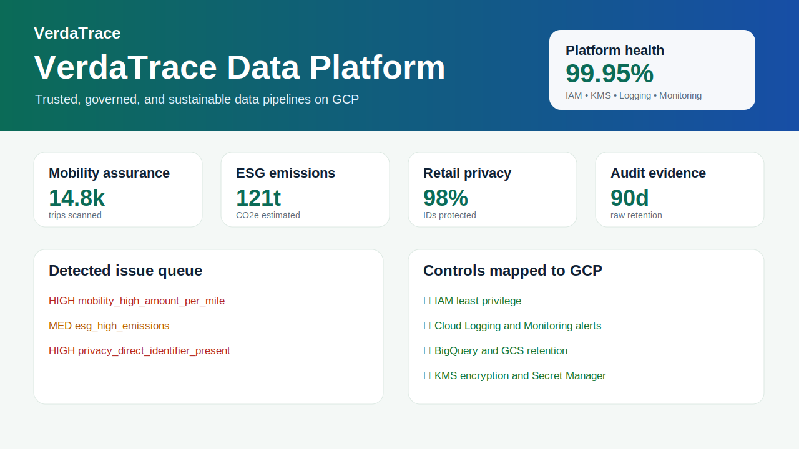
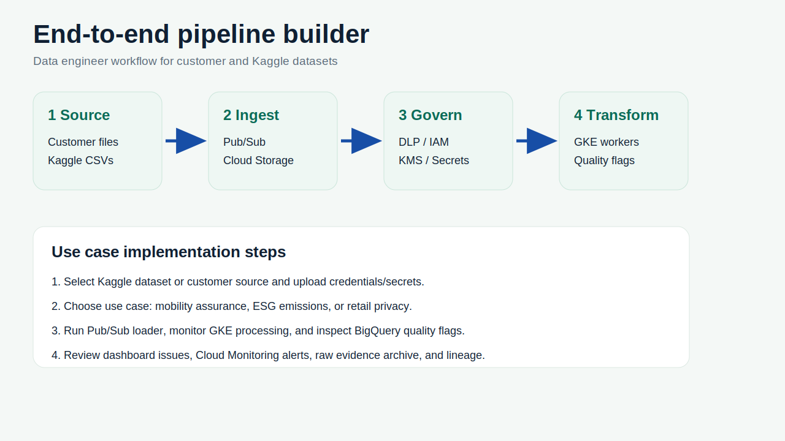

# VerdaTrace Data Platform

**VerdaTrace — A GCP-native platform for trusted, governed, and sustainable data pipelines.**

VerdaTrace is a GCP-native enterprise data platform that receives customer data, validates and governs it, applies privacy controls, archives raw evidence, processes events in the backend, and delivers trusted analytics-ready data to BigQuery and downstream systems.

## Platform use cases

| Use case | Huge Kaggle dataset for demos | Issues the platform detects |
| --- | --- | --- |
| **Mobility expense assurance** | NYC yellow taxi trip data | High fare per mile, unusual tip ratios, negative/zero distance, duplicate trip identifiers. |
| **ESG transport emissions reporting** | Supply-chain or logistics shipment data | High estimated CO2e, missing transport category, duplicate shipment/order IDs. |
| **Retail transaction privacy pipeline** | Multi-category ecommerce behaviour data | Direct identifiers in raw events, missing categories, negative/malformed prices, privacy minimisation gaps. |

The repository does **not** commit huge Kaggle files. Use `config/kaggle_datasets.yml` and `scripts/kaggle_to_pubsub.py` to download datasets in a GCP environment and stream selected CSV rows into Pub/Sub.

## Architecture

| Layer | GCP services | Responsibility |
| --- | --- | --- |
| Sources | Customer apps, Kaggle CSV loader, Cloud Run loaders, Cloud Scheduler, Cloud Storage raw files | Accept customer and demo data from batch or streaming sources. |
| Ingestion | Pub/Sub, Pub/Sub dead-letter topic, Cloud DLP, optional Dataflow | Buffer events, inspect sensitive data, route failed messages and optionally enrich streams. |
| Backend processing | GKE worker pods, Secret Manager, Cloud KMS, Artifact Registry | Run transformations, pseudonymise identifiers, calculate quality flags and pull container images securely. |
| Governed storage | Cloud Storage raw evidence archive, BigQuery curated tables, Dataplex/Data Catalog | Archive raw evidence, publish analytics-ready records and expose metadata/lineage. |
| Operations | IAM, Cloud Logging, Cloud Monitoring, Audit Logs, retention policies | Enforce least privilege, observability, alerting, auditability and lifecycle deletion. |

```text
Customer/Kaggle data -> Pub/Sub -> DLP inspection -> GKE worker -> BigQuery curated table
                                      |              |            |
                                      |              |            +-> Cloud Logging -> Monitoring alerts
                                      |              +--------------> Cloud Storage raw evidence archive
                                      +-----------------------------> Pub/Sub dead-letter topic
Secret Manager + Cloud KMS + IAM protect the backend worker, storage, Pub/Sub and BigQuery.
Dataplex/Data Catalog document the curated BigQuery and raw archive zones.
```


## Platform UI

The UI is a Cloud Run-ready portal for data engineers. It shows platform health, use-case KPIs, detected issue queues, governance controls, and an end-to-end pipeline builder for source selection, ingestion, governance, transformation, and analytics.





### How a data engineer uses the UI for an end-to-end use case

1. Select the use case: mobility expense assurance, ESG transport emissions, or retail transaction privacy.
2. Choose a source: customer upload, operational API, Cloud Storage landing path, or Kaggle CSV loader.
3. Start ingestion to Pub/Sub and monitor backend worker status.
4. Review `quality_flags`, issue severity, raw evidence archive status, and BigQuery output table.
5. Use the controls panel to confirm IAM, Logging, Monitoring, Retention, KMS, and DLP coverage.
6. Copy the deployed Cloud Run URL into demos, documentation, or stakeholder walkthroughs.

## How the backend detects issues

The `data_pipeline.py` worker transforms each raw event into a canonical BigQuery row and adds `quality_flags` for downstream dashboards and alerts:

* `mobility_high_amount_per_mile` for unusually expensive trips.
* `mobility_unusual_tip_ratio` for suspicious mobility expense tips.
* `esg_high_emissions` for high estimated transport emissions.
* `privacy_direct_identifier_present` when raw ecommerce/retail events contain email or phone fields.
* `possible_duplicate_event`, `missing_amount`, `missing_category`, `negative_amount`, and `negative_distance` for common data-quality failures.

## Apply inside GCP environments

1. **Provision security, storage and processing**

   ```bash
   terraform init
   terraform apply -var="project_id=$PROJECT_ID" -var="region=europe-west2"
   ```

   Terraform configures IAM, Cloud Logging/Monitoring, BigQuery partition retention, Cloud Storage lifecycle retention, Pub/Sub DLQ, Cloud KMS encryption, Artifact Registry, GKE, DLP, and the raw archive bucket.

2. **Build and deploy the backend worker**

   ```bash
   docker build -t gcr.io/$PROJECT_ID/verdatrace-data-pipeline:latest .
   docker push gcr.io/$PROJECT_ID/verdatrace-data-pipeline:latest
   kubectl apply -f deployment.yaml
   ```

3. **Download huge Kaggle data in GCP**

   ```bash
   pip install kaggle
   export KAGGLE_CONFIG_DIR=/secrets/kaggle
   kaggle datasets download -d elemento/nyc-yellow-taxi-trip-data -p /data --unzip
   ```

4. **Stream Kaggle rows into Pub/Sub**

   ```bash
   python scripts/kaggle_to_pubsub.py \
     --project "$PROJECT_ID" \
     --topic verdatrace-transaction-events \
     --use-case mobility_expense_assurance \
     --csv /data/yellow_tripdata_2016-01.csv \
     --limit 100000
   ```

5. **Query detected issues in BigQuery**

   ```sql
   SELECT use_case, quality_flags, COUNT(*) AS flagged_rows
   FROM `PROJECT.verdatrace_data_engineering.processed_events`
   WHERE quality_flags != ''
   GROUP BY use_case, quality_flags
   ORDER BY flagged_rows DESC;
   ```

6. **Deploy the frontend portal and capture its URL**

   ```bash
   gcloud run deploy verdatrace-portal \
     --source frontend \
     --region europe-west2 \
     --allow-unauthenticated

   gcloud run services describe verdatrace-portal \
     --region europe-west2 \
     --format='value(status.url)'
   ```

   Put the returned Cloud Run URL in demos and screenshots. The static portal is in `frontend/index.html`, and text screenshot wireframes are in `docs/screenshots.md` so the repository remains binary-free.

## Repository layout

```text
.
├── data_pipeline.py              # Pub/Sub -> transformation -> BigQuery worker
├── deployment.yaml               # Kubernetes deployment for GKE
├── Dockerfile                    # Backend container image definition
├── frontend/                     # Cloud Run portal frontend
├── main.tf                       # Terraform infrastructure definition
├── requirements.txt              # Python runtime dependencies
├── config/kaggle_datasets.yml    # External huge-data dataset registry
├── sample_events/                # Small problematic sample events
├── scripts/kaggle_to_pubsub.py   # Kaggle CSV -> Pub/Sub loader
├── tests/                        # Unit tests for transformations
└── docs/
    ├── architecture.md
    ├── screenshots.md
    └── use_cases.md
```

## Local development

```bash
python -m venv .venv
source .venv/bin/activate
pip install -r requirements.txt
python -m pytest
python data_pipeline.py --local-sample sample_events/nyc_taxi_trip.json
```

## Runtime configuration

| Variable | Description | Default |
| --- | --- | --- |
| `GCP_PROJECT` | GCP project ID | Required for cloud mode |
| `PUBSUB_SUBSCRIPTION` | Pub/Sub subscription name or full path | Required for cloud mode |
| `BQ_DATASET` | BigQuery dataset | `verdatrace_data_engineering` |
| `BQ_TABLE` | BigQuery destination table | `processed_events` |
| `PSEUDONYM_SALT` | Secret salt used before SHA-256 hashing | Empty string for local demo only |
| `RAW_ARCHIVE_BUCKET` | Optional Cloud Storage bucket for encrypted raw-message audit archive | Disabled |

## Governance controls

* **IAM:** Terraform grants the worker only Pub/Sub subscriber, BigQuery data editor, Storage object creator, and KMS encrypter/decrypter permissions required by the pipeline.
* **Logging:** The worker emits structured processing logs without raw personal data.
* **Monitoring:** Terraform creates a log-based metric and alert policy for backend processing errors.
* **Retention:** BigQuery partitions expire after the configured retention period, and the raw Cloud Storage archive uses lifecycle deletion.
* **Privacy:** Direct identifiers are salted and hashed before curated BigQuery storage, while raw events are retained only in the controlled evidence archive.
